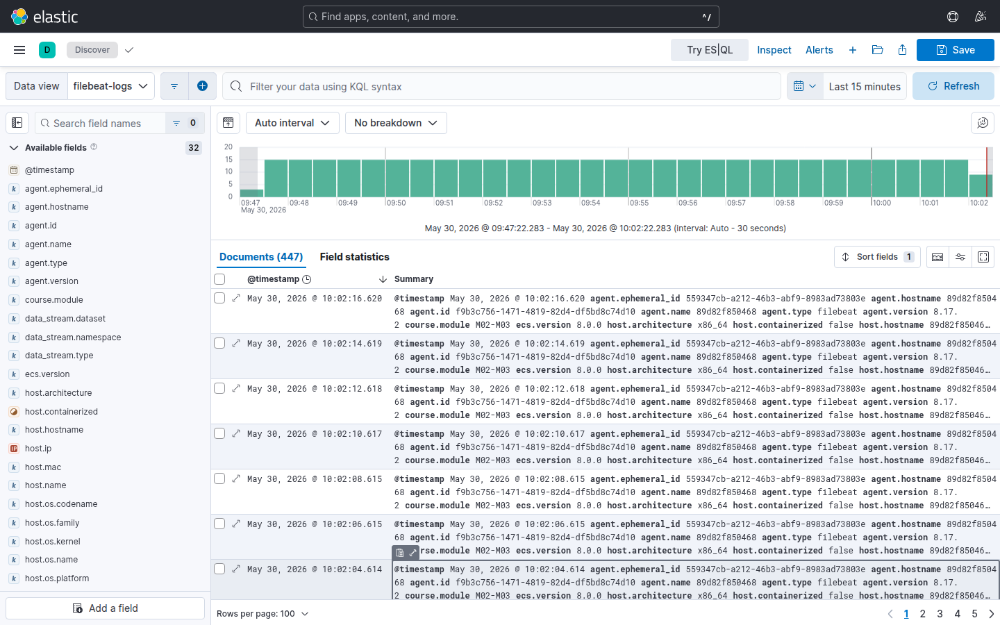
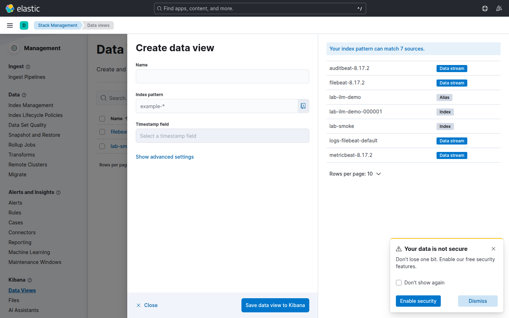
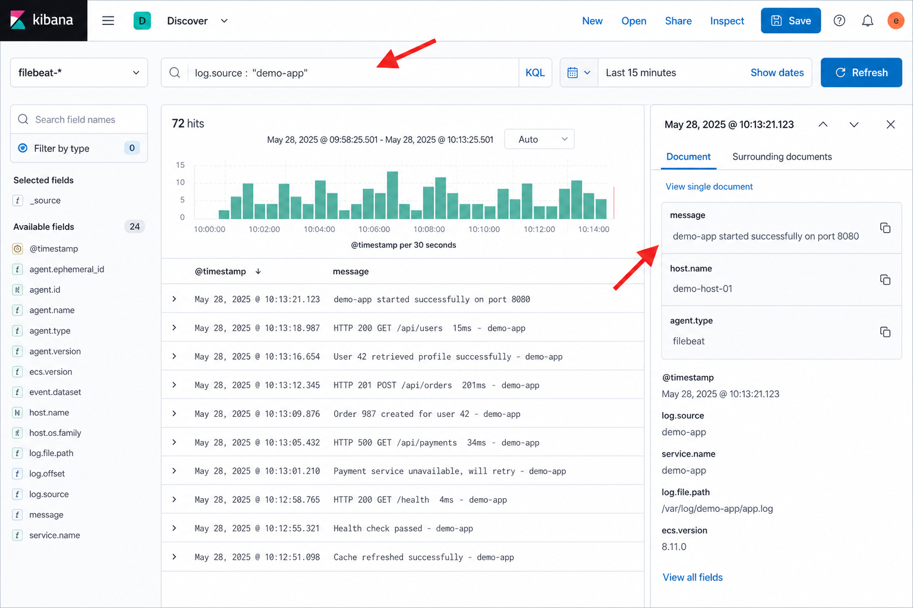

# Kibana Discover — crear un data view (8.x)

Guía visual para el **paso 7 de M01-01** y cualquier ejercicio que use Discover. No asume que hayas usado Kibana antes.

> **Data view** (antes *index pattern*): nombre lógico que apunta a uno o más índices o data streams en Elasticsearch (p. ej. `filebeat-*`). Discover no muestra documentos hasta que exista al menos uno con campo de tiempo.

Documentación oficial: [Data views](https://www.elastic.co/docs/explore-analyze/data-visualization/data-views) · [Discover](https://www.elastic.co/docs/explore-analyze/discover).

---

## Antes de abrir el navegador

Comprueba que hay datos recientes en Elasticsearch (si esto falla, Discover estará vacío aunque el data view sea correcto):

```bash
curl -fsS 'http://localhost:5601/api/status' | grep -q available && echo "Kibana OK" || echo "Kibana aún arrancando"
curl -fsS 'http://localhost:9200/filebeat-*/_count'
curl -fsS 'http://localhost:9200/_cat/indices/filebeat*,.ds-filebeat*?v' 2>/dev/null | head
```

`_count` debe ser > 0 tras el paso 5 de M01-01.

---

## 1 — Abrir Kibana en Codespaces

1. Barra inferior o lateral → pestaña **Ports** (Puertos).
2. Localiza el puerto **5601**.
3. Clic en **Open in Browser** (icono globo / enlace).
4. Si la página tarda o dice *Connecting to the forwarded port…*, espera 30–60 s y recarga. Kibana tarda más que Elasticsearch en estar lista.

URL típica: `https://….app.github.dev` (puerto 5601 reenviado). No uses `localhost:5601` fuera del Codespace.

---

## 2 — Ir a Discover

1. Clic en el menú **☰** (arriba a la izquierda).
2. Sección **Analytics** → **Discover**.



**Qué verás**

| Pantalla | Significa |
|----------|-----------|
| Botón **Create a data view** / *Crear data view* | Normal la primera vez. Sigue la sección 3. |
| Discover con tabla de documentos | Ya hay data view. Salta a la sección 4. |
| Selector de data view arriba a la izquierda | Despliega y elige `filebeat-*` o crea uno nuevo desde **Create a data view**. |

---

## 3 — Crear el data view `filebeat-*`

### Opción A — Desde Discover

Clic en **Create a data view**.

### Opción B — Desde gestión

☰ → **Management** → **Stack Management** → **Kibana** → **Data Views** → **Create data view**.

### Rellenar el formulario



| Campo | Valor | Notas |
|-------|-------|-------|
| **Name** | `filebeat-logs` (o cualquier nombre) | Solo etiqueta en Kibana. |
| **Index pattern** | `filebeat-*` | Debe coincidir con los índices/data streams que crea Filebeat. Tras escribir, Kibana muestra coincidencias. |
| **Timestamp field** | `@timestamp` | Obligatorio para la línea temporal. Si no aparece, el índice no tiene datos o el patrón no coincide. |

Clic en **Save data view to Kibana** / *Guardar*.

Si Kibana avisa de que no hay coincidencias: vuelve a terminal y confirma `_count` > 0 y que Filebeat lleva al menos 1 minuto indexando.

---

## 4 — Ver eventos en Discover



1. **Selector de data view** (arriba izquierda): elige el que acabas de crear.
2. **Time picker** (arriba, calendario / *Last 15 minutes*): elige **Last 15 minutes** o **Last 1 hour**.  
   Los logs de `loggen` son **recientes**; si dejas *Last 7 days* vacío o un rango antiguo, la tabla puede parecer vacía.
3. **Barra de búsqueda KQL**: escribe  
   `log_source : "demo-app"`  
   y pulsa Enter. Alternativa si el filtro no devuelve filas: `message : *demo-app*`.
4. **Tabla central**: filas con `@timestamp` y `message`.

5. **Ver campos del documento** (la UI de 8.x no siempre muestra un panel fijo a la derecha como en la captura de referencia):

   | Método | Cómo |
   |--------|------|
   | **Expandir fila** | Clic en la flecha **`>`** a la izquierda de una fila → se despliega el JSON/campos **debajo** de esa fila. |
   | **Añadir columnas** | Barra lateral **izquierda** → *Available fields* → busca `log_source`, `host.name`, `agent.type` → botón **`+`** para mostrarlos en la tabla. |
   | **Documento completo** | Con la fila expandida, pestaña **JSON** o **Table** (según versión) para ver todos los campos. |

   Localiza al menos: `message`, `log_source`, `host.name`, `agent.type`.

Compara el `message` con la última línea de `tail infra/samples/logs/app.log` del paso 6.

---

## Discover vacío — checklist

| Comprobación | Acción |
|--------------|--------|
| Time picker demasiado estrecho o antiguo | **Last 15 minutes** o **Last 24 hours** |
| Data view incorrecto | Patrón `filebeat-*`, timestamp `@timestamp` |
| `_count` = 0 en terminal | Filebeat / loggen / perfil `beats` (M01-01 paso 3) |
| Kibana aún arrancando | Esperar y `/api/status` |
| Filtro KQL demasiado estricto | Borra la barra y pulsa Enter; luego vuelve a filtrar |

---

## Atajos útiles

| Quiero… | Dónde |
|---------|--------|
| Cambiar data view | Selector arriba izquierda en Discover |
| Editar o borrar data views | ☰ → Management → Stack Management → Data Views |
| Ver índices físicos | ☰ → Management → Stack Management → Index Management |
| Refrescar datos | Botón Refresh junto al time picker |
