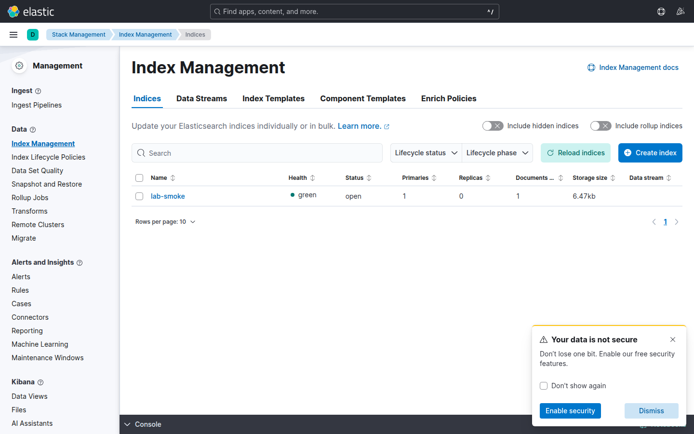

# Laboratorio M02-02 — Añadir la capa de visualización (Kibana)

[← Página anterior](M02-01-solo-elasticsearch.md) · [▲ Módulo M02](README.md) · [Siguiente página →](M02-03-filebeat-ingesta-viva.md)

> ⏱️ ~30 min · 🧩 Requisitos: M02-01 (Elasticsearch healthy + `lab-smoke`) · 🖥️ Terminal + navegador

Levantamos **Kibana** sobre el nodo que ya tenemos y buscamos en Discover el documento `lab-smoke` que indexamos solo con `curl`. Si aparece, habremos comprobado que Kibana **no almacena** nada: solo consulta lo que Elasticsearch ya tiene.

---

### Paso 1 — Arrancar Kibana sobre ES existente

Kibana es un **cliente stateless** de Elasticsearch. `depends_on: service_healthy` en Compose evita que Kibana arranque contra un ES que aún no acepta conexiones — patrón que repetiremos al ordenar Beats después de ES.

Con Elasticsearch aún en marcha:

```bash
docker compose -f infra/docker-compose.yml up -d kibana
docker compose -f infra/docker-compose.yml ps
```

Esperamos ver `lab-elasticsearch` **healthy** y `lab-kibana` **Up** (Kibana tarda 60–90 s en estar listo).

---

### Paso 2 — API de estado antes de abrir el navegador

La UI tarda más que la API en estar lista. `/api/status` indica si Kibana **ya puede servir** Discover; abrir el navegador antes genera pantallas en blanco que no distinguen «Kibana caído» de «Kibana arrancando».

```bash
curl -fsS http://localhost:5601/api/status 2>/dev/null | head -c 400; echo
```

Repetimos cada 20 s hasta ver `available` o similar en el JSON.

---

### Paso 3 — Abrir Discover y encontrar `lab-smoke`

El documento lo indexamos con `curl` en M02-01 — no pasó por Filebeat. Si lo vemos en Discover, confirmamos la cadena **ES → data view → KQL** sin ruido de ingesta. El time picker es filtro duro: Discover no muestra documentos fuera del rango aunque existan en ES.

1. Codespaces → **Ports** → abrir **5601**.
2. ☰ → **Analytics** → **Discover**.
3. Crear data view **`lab-smoke`** con campo de tiempo `@timestamp`.
4. Ampliar el time picker a **Last 1 year** (el smoke tiene fecha fija).
5. Filtro KQL: `course.exercise : "M02-01"`.


El documento de M02-01 tiene `@timestamp` fijo (`2026-05-29`), así que en Discover usamos **Last 1 year** (o un rango que lo cubra). Discover filtra por tiempo antes de mostrar filas — con «Last 15 minutes» parecería que no hay datos aunque ES tenga el doc. Es el error más habitual en soporte: «curl ve datos, Kibana no».

Esperamos ver el documento del paso 4 de M02-01. Si no aparece:

```bash
curl -fsS 'http://localhost:9200/lab-smoke/_search?pretty'
```

Si `curl` sí lo ve y Discover no → problema de data view o rango de tiempo, no de ES.

---

### Paso 4 — Stack Management: el índice físico

Discover opera sobre **vistas lógicas**; Index Management muestra **índices físicos** (docs, tamaño, salud). Cuando un data view apunta a un patrón vacío o mal escrito, esta pantalla delata el desajuste antes de tocar agentes.

☰ → **Management** → **Stack Management** → **Index Management**.



Confirmamos el índice `lab-smoke` con al menos 1 documento.

---

### Paso 5 — Cortar Elasticsearch y observar Kibana

Fijamos **dirección de dependencia**. ES caído → Kibana inútil; Kibana caído → ingesta puede continuar. En on-call separamos «no veo datos» (UI) de «no entran datos» (Beats/ES) — aquí lo comprobamos en 30 segundos.

```bash
docker compose -f infra/docker-compose.yml stop elasticsearch
```

Refresca Discover o vuelve a cargar Kibana: deberíamos ver errores o datos no actualizables.

```bash
docker compose -f infra/docker-compose.yml start elasticsearch
```

Tras `healthy`, Discover vuelve a funcionar. **Kibana depende de ES; nunca al revés.**

| Componente caído | ¿Siguen entrando logs a ES? | ¿Carga Kibana? |
|------------------|----------------------------|----------------|
| Elasticsearch | No (Beats acumulan o fallan) | No / error |
| Kibana | Sí | No |
| Filebeat | No nuevos | Sí (datos viejos) |

En producción separaríamos «incidente de visualización» (Kibana) de «incidente de ingesta» (Beats/ES) — aquí lo comprobamos en miniatura.

---

## Validación

- [ ] Discover muestra el documento `M02-01` en `lab-smoke`.
- [ ] Index Management lista `lab-smoke`.
- [ ] Sin ES, Kibana deja de ser útil (lo comprobamos en el paso 5).

---

## Antes de seguir

- Data view = nombre lógico (`lab-smoke`) sobre un índice real.
- `ELASTICSEARCH_HOSTS=http://elasticsearch:9200` en el compose (DNS interno).
- Sin security, cualquiera con el puerto 5601 ve los datos (M09 lo endurecerá).

### Reto (tómate tu tiempo)

1. `docker logs lab-kibana --tail 20` — localiza conexión al cluster.
2. ¿Qué tres cosas mirarías si la UI carga pero Discover está vacío?
3. (Opcional) [Discover](https://www.elastic.co/docs/explore-analyze/discover)

<details>
<summary>Ver respuestas</summary>

**1. Logs de Kibana**

```bash
docker logs lab-kibana --tail 20
```

Busca líneas con `elasticsearch` / `http://elasticsearch:9200` — confirma que la UI se conecta al servicio ES por DNS interno de Compose.

**2. UI carga pero Discover vacío**

1. **Rango de tiempo** (time picker) — amplía a *Last 1 year* para `lab-smoke` con fecha fija.
2. **Data view** — existe y apunta al índice correcto (`lab-smoke`, campo `@timestamp`).
3. **Datos en ES** — `curl localhost:9200/lab-smoke/_count` > 0 (problema de UI vs problema de ingesta).

**3. Discover (opcional)**

Herramienta de exploración ad-hoc: filtra, expande documentos y valida campos antes de montar dashboards.

</details>
