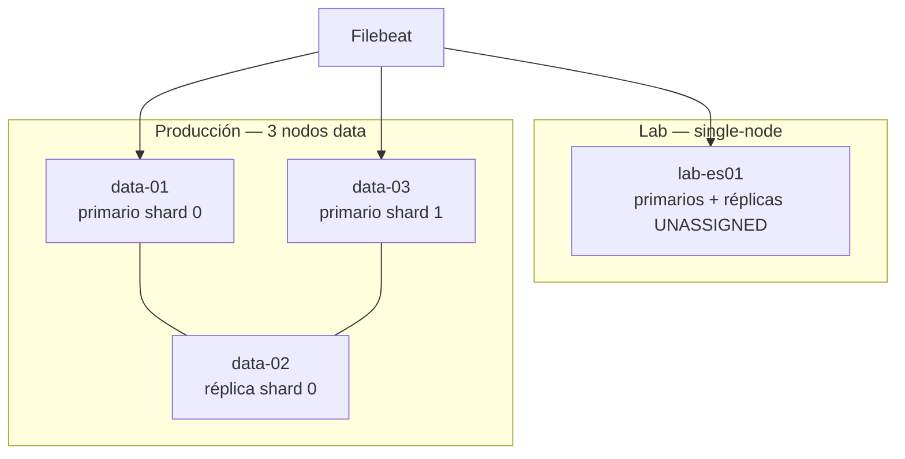

# Laboratorio M02-05 — De single-node a alta disponibilidad: shards y réplicas

[← Página anterior](M02-04-fallos-y-recovery.md) · [▲ Módulo M02](README.md) · [Módulo siguiente: M03 — Recolección →](../M03-recoleccion-beats/README.md)

> ⏱️ ~35 min · 🧩 Diseño + comandos en el lab single-node · 📎 [Elasticsearch](../../docs/componentes/elasticsearch.md) · [CAP y consistencia](../../docs/cap-y-consistencia-stack.md)

Cerramos M02 con **shards primarios**, **réplicas** y los estados **`green` / `yellow` / `red`**: qué significan en nuestro nodo único y qué cambia en un clúster **multi-nodo** de producción. En M02-01 vimos `single-node` y en M02-04 tocamos `_cat/shards`; aquí conectamos esas piezas con alta disponibilidad — sin montar tres nodos (RAM del Codespace), pero con evidencia en nuestro clúster y un diseño explícito para prod.

---

### Paso 1 — Confirmar topología del lab

`discovery.type=single-node` elimina elección de master y quorum — válido en lab, **no** en prod. Antes de hablar de HA, fijemos qué compromisos acepta el entorno del lab actual (1 nodo, réplicas sin asignar).

```bash
grep -E 'discovery.type|cluster.name|node.name' infra/docker-compose.yml
curl -fsS 'http://localhost:9200/_cluster/health?pretty' | grep -E 'cluster_name|status|number_of_nodes|active_primary_shards|active_shards|unassigned_shards'
curl -fsS 'http://localhost:9200/_cat/nodes?v&h=name,node.role,master'
```

Anota:

| Campo | Valor esperado en lab |
|-------|------------------------|
| `discovery.type` | `single-node` |
| `number_of_nodes` | `1` |
| `status` | `green` o **`yellow`** |

---

### Paso 2 — Shards y réplicas en los índices

Elasticsearch **particiona** cada índice en shards primarios (escritura) y opcionalmente réplicas (lectura + failover). `_cat/shards` es la radiografía — ahí ves si un shard está `STARTED` o `UNASSIGNED`, no solo el color agregado del clúster.

Cada índice (o backing index de un data stream) se divide en **shards primarios**; las **réplicas** son copias de lectura/failover.

```bash
curl -fsS 'http://localhost:9200/_cat/indices/filebeat-*,lab-smoke?v&h=index,pri,rep,docs.count,store.size'
curl -fsS 'http://localhost:9200/_cat/shards/filebeat-*?v&h=index,shard,prirep,state,node' | head -20
```

Interpretación:

| Columna / valor | Significado |
|-----------------|-------------|
| `pri` | Número de shards **primarios** del índice |
| `rep` | **Réplicas** configuradas por shard primario (default suele ser `1`) |
| `prirep` = `p` | Shard primario — el que recibe escrituras |
| `prirep` = `r` | Réplica — copia del primario |
| `state` = `STARTED` | Shard asignado y activo en un nodo |
| `state` = `UNASSIGNED` | Elasticsearch **quiere** ese shard pero **no hay nodo** donde ponerlo |

En **single-node**, las réplicas quedan `UNASSIGNED` → clúster **`yellow`**. Los primarios siguen sirviendo lecturas y escrituras; **no hay redundancia**.

---

### Paso 3 — Por qué `yellow` no es “fallo” en el lab

El color del clúster resume **asignación de shards**, no calidad de logs ni ingesta. `allocation/explain` traduce el yellow en razón concreta — en single-node casi siempre «no hay otro nodo para la réplica».

```bash
curl -fsS 'http://localhost:9200/_cluster/allocation/explain?pretty' \
  -H 'Content-Type: application/json' \
  -d '{"index":"filebeat-*","shard":0,"primary":false}' 2>/dev/null | head -30
```

Elasticsearch suele explicar que la réplica no se asigna porque **no hay otro nodo data** (o la misma regla en single-node).

| Estado | Primarios | Réplicas | En lab single-node | En prod multi-nodo |
|--------|-----------|----------|--------------------|--------------------|
| **green** | OK | OK | Raro (solo si `number_of_replicas: 0`) | Objetivo habitual |
| **yellow** | OK | Alguna sin asignar | **Normal** con rep=1 | Transitorio tras caída de nodo o rebalanceo |
| **red** | Alguno sin asignar | — | Disco lleno, corrupción, fallo grave | **Incidente** — prioridad máxima |

**Caso de uso:** un operador nuevo ve `yellow` en staging y abre incidente P1. En single-node es esperado; en prod de tres nodos data, `yellow` persistente indica capacidad insuficiente o nodo caído.

---

### Paso 4 — Diagrama: lab vs producción

Vemos **dónde vive la redundancia**. En prod la HA está en réplicas en nodos distintos; Filebeat en un solo host no aporta HA de datos — si cae el host, perdemos ingesta de ese host hasta que vuelva el agente.



Roles que aparecen en prod (no los simulas todos en el lab):

| Rol | Función breve |
|-----|----------------|
| **master-eligible** | Coordinación del clúster, asignación de shards (quorum impar, típ. 3) |
| **data** | Almacena shards primarios y réplicas |
| **ingest** | Opcional: pipelines de ingest en nodo dedicado |
| **coordinating** | Opcional: solo enruta consultas |

Referencia: [docs/componentes/elasticsearch.md](../../docs/componentes/elasticsearch.md).

---

### Paso 5 — Tabla lab → producción (rellena)

Traducimos lo que ves en el lab a **decisiones de diseño** en prod: cuántos nodos data, cuántas réplicas, qué pasa si cae el único nodo. Esta tabla es el puente hacia M10 (operación) y M12 (sizing).

| Pregunta | Nuestro lab (1 nodo) | Producción típica |
|----------|-----------------|-------------------|
| ¿Cuántos nodos data? | 1 | ≥ 3 (según volumen) |
| `number_of_replicas` | 1 (default) → **yellow** | 1+ con nodos suficientes → **green** |
| Si cae el único nodo ES | **Indisponibilidad total** + riesgo de datos en volumen | Si hay réplica en otro nodo, **failover** del primario |
| HA de Filebeat | Un contenedor; si cae, solo perdemos ingesta de ese host | Un Beat por host / DaemonSet — la HA del dato está en **ES**, no en el agente |
| HA de Kibana | Una instancia | Varias instancias stateless + LB; estado en ES |
| Sizing shards | ILM crea backing indices pequeños | Objetivo **20–50 GB/shard** (ver M12-04) |

---

### Paso 6 — Parámetros que mueven la disponibilidad

`number_of_replicas` y `wait_for_active_shards` son palancas del trade-off **disponibilidad ↔ consistencia** (marco CAP en [docs/cap-y-consistencia-stack.md](../../docs/cap-y-consistencia-stack.md)). Los leemos ahora; no los cambies sin entender el efecto en ack de bulk.

No los cambiamos en el lab salvo el ejercicio opcional — solo **lee** qué existen:

```bash
curl -fsS 'http://localhost:9200/filebeat-*/_settings?filter_path=**.number_of_replicas' 2>/dev/null | head -10
curl -fsS 'http://localhost:9200/_cluster/settings?include_defaults=true&filter_path=**.wait_for_active_shards' 2>/dev/null | head -10
```

| Parámetro | Efecto |
|-----------|--------|
| `index.number_of_replicas` | Cuántas copias por primario; `0` = green en single-node pero **sin HA** |
| `wait_for_active_shards` | Cuántas copias deben confirmar antes de ack en bulk (más estricto = más consistencia, menos disponibilidad bajo fallo) |
| Topología multi-nodo | Sin al menos **dos nodos data**, `number_of_replicas: 1` no puede estar green |

Marco CAP del pipeline: [docs/cap-y-consistencia-stack.md](../../docs/cap-y-consistencia-stack.md).

---

### Paso 7 — Ejercicio de diseño (escrito)

Sin montar tres nodos, razonamos como **arquitectos**: yellow en lab vs yellow en prod no significan lo mismo; el quorum impar de masters evita split-brain. Las respuestas escritas fijan criterio antes de M03.

Respondemos en 3–5 frases:

1. Nuestro clúster lab está **`yellow`**. ¿Es bug? ¿Qué comprobarías antes de escalar a prod?
2. Un nodo **data** cae en prod con `number_of_replicas: 1` y tres nodos. ¿Qué esperas de `_cluster/health` y de `_cat/shards`?
3. ¿Por qué **tres** nodos master-eligible (no dos) en producción?

<details>
<summary>Pistas (no spoilers completos)</summary>

1. En single-node, yellow por réplicas sin asignar es **esperado**. En prod, revisarías nodos caídos, disco, `allocation/explain`.
2. Con réplica en otro nodo, Elasticsearch **promueve** réplica a primario; health puede pasar por yellow breve y volver a green.
3. Quorum impar evita **split-brain** (dos masters simultáneos).

</details>

---

### Paso 8 — Opcional: `green` forzado en lab (solo didáctico)

Bajar réplicas a 0 elimina el yellow **a costa de cero redundancia** — green engañoso. Lo hacemos solo para ver la mecánica; en prod sería una regresión de HA, no una «optimización».

Para ver **`green`** en single-node (aceptando **cero HA**):

```bash
# Solo en lab — NO es recomendación de producción
curl -fsS -X PUT 'http://localhost:9200/filebeat-*/_settings' \
  -H 'Content-Type: application/json' \
  -d '{"index":{"number_of_replicas":0}}'
curl -fsS 'http://localhost:9200/_cluster/health?pretty' | grep status
```

Volvemos a comprobar `_cat/shards`: ya no deberían aparecer réplicas `UNASSIGNED`. Documenta el trade-off: **green ≠ alta disponibilidad**.

---

## Validación

- [ ] Ejecutamos `_cat/shards` y distinguimos primario vs réplica.
- [ ] Explicamos por qué `yellow` es normal en single-node con `rep=1`.
- [ ] Completamos la tabla lab → producción.
- [ ] (Opcional) Probamos `number_of_replicas: 0` y relacionamos green con pérdida de redundancia.

---

## Antes de seguir

M03 profundiza en **Beats** (más agentes, misma topología ES). M10 y M12 vuelven a **salud del clúster** y **sizing de shards** con datos reales de operación.

**No montamos tres nodos ES en este repo** por límites de RAM (~8 GB en Codespaces). En un proyecto real, el siguiente paso sería ECK/Helm con tres nodos data y comprobar `green` tras `kubectl drain` de un nodo.
