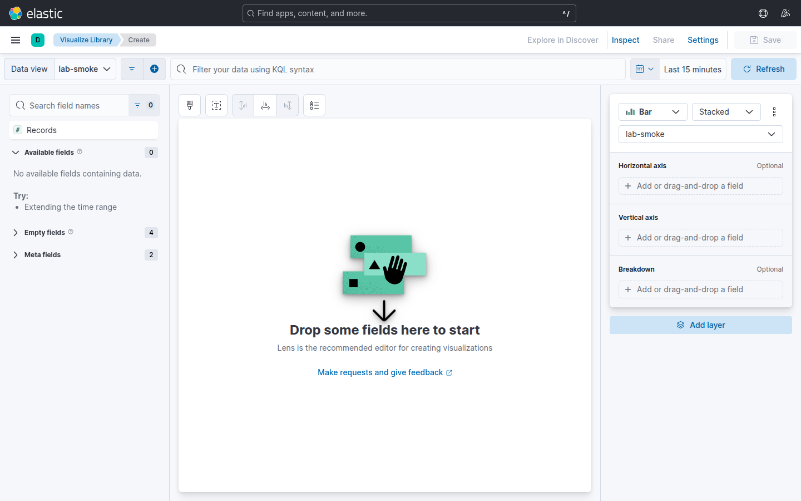

# Laboratorio M05-01 — Lens: de Discover a la primera visualización

[▲ Módulo M05](README.md) · [Siguiente →](M05-02-dashboard-logs-operacion.md)

> ⏱️ ~40 min · 🧩 Campos parseados (M04) o filtro por texto en `message`

**Objetivo:** crear una visualización Lens de **conteo por código HTTP** a partir de logs `demo-app`.

> **Por qué Lens:** Discover responde «¿qué eventos hay?»; Lens responde «¿cuántos por categoría y cómo evolucionan?». Es el puente entre exploración ad-hoc y dashboards que el equipo de guardia abre cada mañana.

---

### Paso 1 — Stack con datos

Sin datos recientes, Lens muestra gráficos vacíos aunque el data view sea correcto — igual que Discover.

```bash
docker compose -f infra/docker-compose.yml --profile beats up -d
./scripts/health-check.sh
```

Kibana → **Discover** → data view `filebeat-*` → `log_source : "demo-app"`.

Confirma que ves filas en los últimos 15 min antes de abrir Lens. Si Discover está vacío, vuelve a M01/M03 antes de seguir.

---

### Paso 2 — Abrir Visualize desde Discover

Partir de Discover con filtro activo **hereda** el contexto (data view + KQL) a Lens — evitas reconfigurar el mismo filtro dos veces.

1. Con el filtro activo, menú **Inspect** o **Open in Lens** (según build: *Visualize* / *Explore in Lens*).
2. Tipo sugerido: **Vertical bar** o **Donut** — donut para proporciones; barras si luego añades eje temporal.



3. Métrica: **Count of records** (cuántas líneas de log cumplen el filtro).
4. Dimensión: `http.response.status_code` (si M04 parseó bien). Si no existe:
   - **Runtime field** en el data view, o
   - varios filtros KQL (`message : *status=500*`) en visualizaciones separadas — más frágil pero válido en lab.

**Caso de uso:** SRE quiere ver de un vistazo si los 500 superan el 5 % del tráfico. Un donut por `status_code` lo hace visible sin escribir agregaciones JSON.

---

### Paso 3 — Ajustar tiempo

Time picker: **Last 15 minutes**. Auto-refresh: **30 s** (simula panel en sala de operaciones).

Salida esperada: segmentos **200 / 404 / 500** alineados con la mezcla del `loggen` (~70/20/10). Si solo ves 200, amplía ventana o comprueba que `loggen` sigue activo.

**Piensa:** ¿cambiaría la interpretación si miraras «Last 24 hours» durante un despliegue nocturno?

---

### Paso 4 — Guardar

**Save** → nombre `lab-m05-status-codes` → espacio *Default*.

Al guardar creas un **saved object** en Elasticsearch (no un PNG): otros usuarios pueden reutilizarlo en dashboards. Anota el nombre exacto — M05-02 lo embeberá.

---

### Paso 5 — Validar con API (opcional)

Compara lo que ves en Lens con una agregación directa — útil cuando alguien dice «el dashboard miente».

```bash
curl -fsS -H 'Content-Type: application/json' \
  'http://localhost:9200/filebeat-*/_search?pretty' \
  -d '{
    "size": 0,
    "query": {"term": {"log_source": "demo-app"}},
    "aggs": {
      "by_status": {
        "terms": {
          "script": {
            "source": "if (doc[\"message.keyword\"].size()==0) return \"unknown\"; def m = /status=(\\d+)/.matcher(doc[\"message.keyword\"].value); m.find() ? m.group(1) : \"unknown\""
          },
          "size": 5
        }
      }
    }
  }' 2>/dev/null | head -25
```

Las proporciones deben ser del mismo orden de magnitud que en Lens (no hace falta pixel-perfect).

---

## Validación

- [ ] Visualización guardada visible en **Visualize library**.
- [ ] Proporción 200 > 404 > 500 coherente con `loggen`.
- [ ] Time picker y refresh configurados.

---

## Antes de seguir

Lens aprende del **data view** y de campos bien tipados (M04). Scripts en runtime salvan el lab pero en producción prioriza parseo en ingest — menos sorpresas cuando cambia el formato del log.
