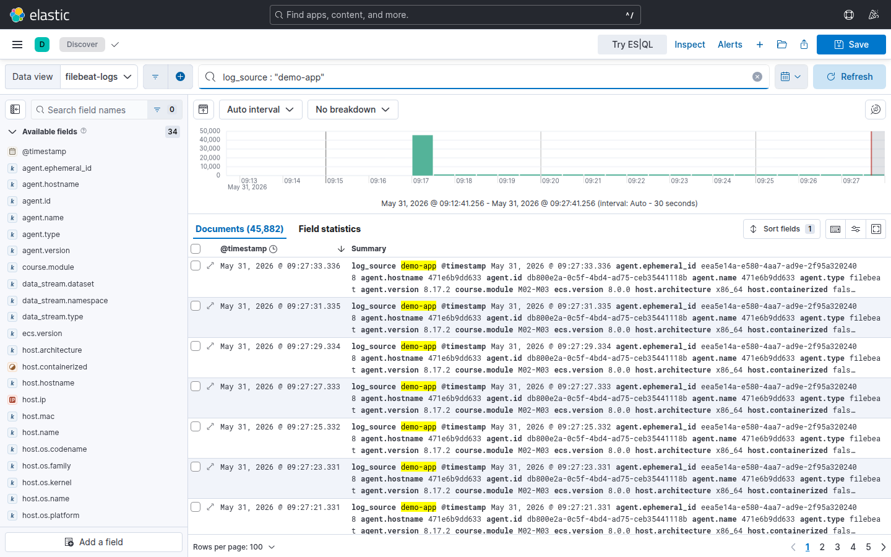
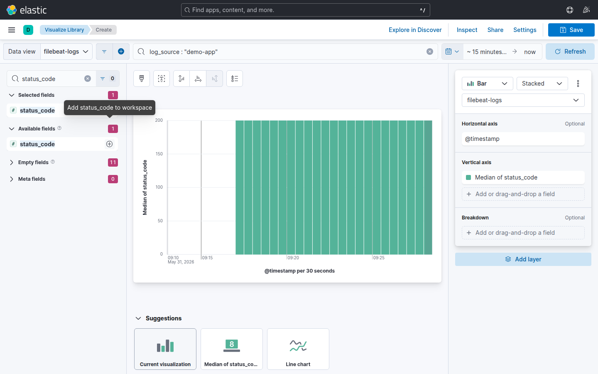

# Laboratorio M05-01 — Lens: de Discover a la primera visualización

[▲ Módulo M05](README.md) · [Siguiente →](M05-02-dashboard-logs-operacion.md)

> ⏱️ ~40 min · 🧩 Campos parseados (M04) o **runtime fields** en el data view

**Objetivo:** crear una visualización Lens de **conteo por código HTTP** a partir de logs `demo-app`.

> **Por qué Lens:** Discover responde «¿qué eventos hay?»; Lens responde «¿cuántos por categoría y cómo evolucionan?». Es el puente entre exploración ad-hoc y dashboards que el equipo de guardia abre cada mañana.

---

### Paso 1 — Stack con datos

Sin datos recientes, Lens muestra gráficos vacíos aunque el data view sea correcto — igual que Discover.

```bash
docker compose -f infra/docker-compose.yml --profile beats up -d
./scripts/health-check.sh
```

**Ruta A — con M04 (Logstash):** si completaste M04, levanta también Logstash para campos ECS parseados:

```bash
docker compose -f infra/docker-compose.yml \
  -f infra/docker-compose.logstash.yml \
  --profile beats --profile logstash up -d
```

**Ruta B — sin Logstash (lab rápido):** añade **runtime fields** al data view `filebeat-*` para extraer `status_code` y `latency_ms` del campo `message`:

1. **Stack Management** → **Data Views** → `filebeat-*` → **Add field**
2. Nombre `status_code`, tipo **long**, script Painless:

```text
if (params._source.message == null) return;
def m = /status=(\d+)/.matcher(params._source.message);
if (m.find()) emit(Long.parseLong(m.group(1)));
```

3. Repite con `latency_ms` y el patrón `latency_ms=(\d+)`.

> Con M04 activo usarás `http.response.status_code` nativo; con runtime fields usa `status_code` — el resultado en Lens es equivalente para este lab.

---

### Paso 2 — Confirmar en Discover

Kibana → **Discover** → data view `filebeat-*` → KQL:

```text
log_source : "demo-app"
```

Time picker: **Last 24 hours** (o **Search entire time range** si el lab lleva tiempo parado).



Confirma histograma con actividad y filas con `status=200/404/500` en `message`. Si está vacío, vuelve a M01/M03 antes de abrir Lens.

---

### Paso 3 — Abrir Lens

1. Menú lateral → **Visualize Library** → **Create visualization** (o desde Discover: **Open in Lens** / **Visualize** con el filtro activo).
2. Data view: **`filebeat-logs`** (`filebeat-*`).
3. KQL (heredado o manual): `log_source : "demo-app"`.
4. Time picker: **Last 15 minutes** · Auto-refresh: **30 s**.

---

### Paso 4 — Donut por código HTTP

En el panel de campos (izquierda):

1. Busca `status_code` (runtime) o `http.response.status_code` (M04).
2. Clic en **+** junto al campo → Lens lo añade al workspace.
3. Panel derecho → tipo de gráfico → **Donut** (o **Pie**).
4. Métrica: **Count of records** · Dimensión: **status_code** (breakdown).



**Caso de uso:** SRE quiere ver de un vistazo si los 500 superan el 5 % del tráfico. Un donut por `status_code` lo hace visible sin escribir agregaciones JSON.

Salida esperada: segmentos **200 / 404 / 500** alineados con la mezcla del `loggen` (~70/20/10).

---

### Paso 5 — Guardar

**Save** → nombre `lab-m05-status-codes` → espacio *Default*.

Al guardar creas un **saved object** en Elasticsearch (no un PNG): otros usuarios pueden reutilizarlo en dashboards. Anota el nombre exacto — M05-02 lo embeberá.

---

### Paso 6 — Validar con API (opcional)

Compara lo que ves en Lens con una agregación directa — útil cuando alguien dice «el dashboard miente».

```bash
curl -fsS -H 'Content-Type: application/json' \
  'http://localhost:9200/filebeat-*/_search?pretty' \
  -d '{
    "size": 0,
    "query": {"term": {"log_source": "demo-app"}},
    "aggs": {
      "by_status": {
        "terms": {
          "script": {
            "source": "if (doc[\"message.keyword\"].size()==0) return \"unknown\"; def m = /status=(\\d+)/.matcher(doc[\"message.keyword\"].value); m.find() ? m.group(1) : \"unknown\""
          },
          "size": 5
        }
      }
    }
  }' 2>/dev/null | head -25
```

Las proporciones deben ser del mismo orden de magnitud que en Lens (no hace falta pixel-perfect).

---

## Validación

- [ ] Visualización guardada visible en **Visualize library** (`lab-m05-status-codes`).
- [ ] Proporción 200 > 404 > 500 coherente con `loggen`.
- [ ] Time picker y refresh configurados.

---

## Antes de seguir

Lens aprende del **data view** y de campos bien tipados (M04 o runtime fields). En producción prioriza parseo en ingest — menos sorpresas cuando cambia el formato del log.

**Regenerar capturas del módulo:** `npm run capture-m05-screenshots` (requiere stack en marcha y Chrome).
