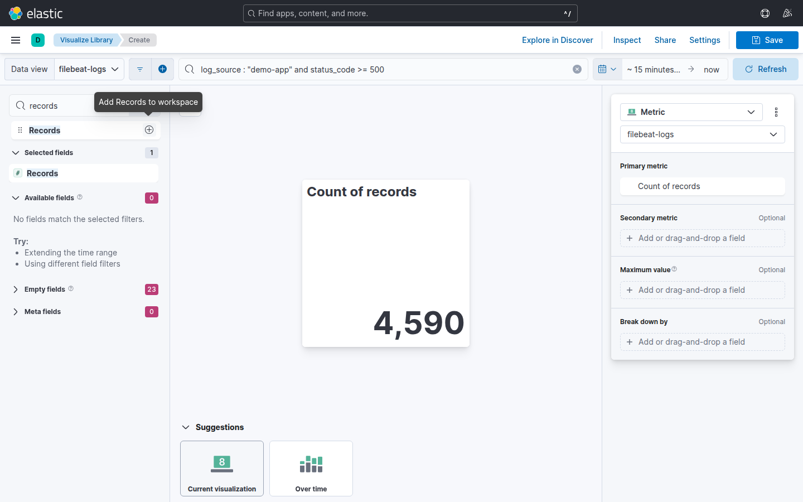
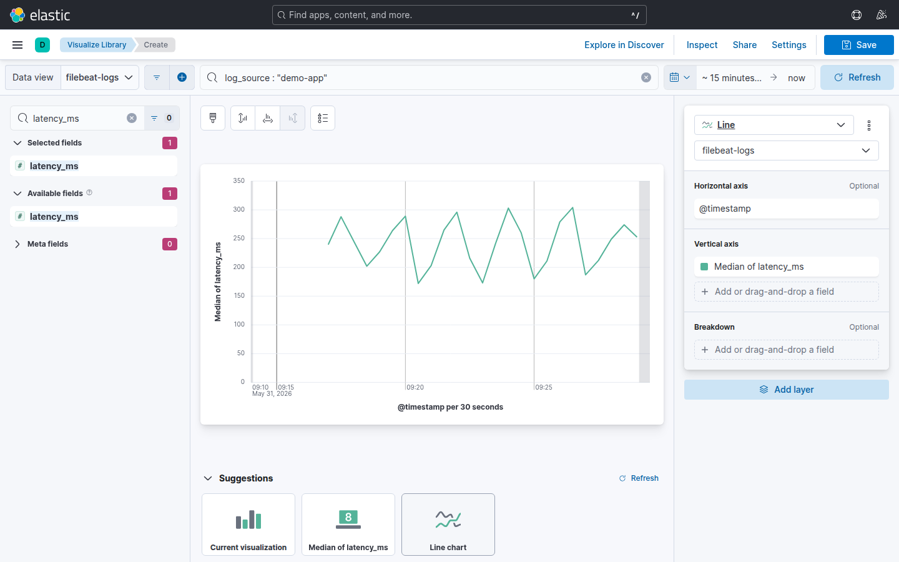
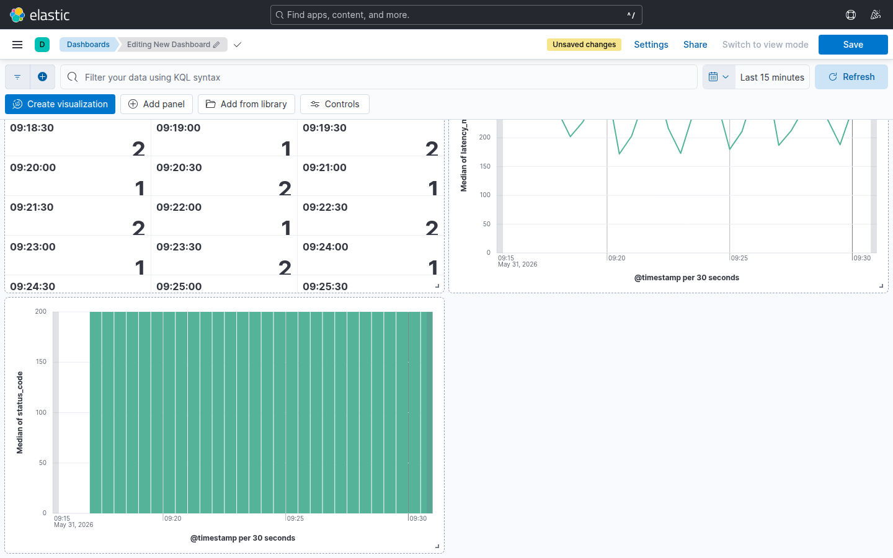

# Laboratorio M05-02 — Dashboard operativo de logs

[▲ Módulo M05](README.md) · [← Anterior](M05-01-lens-primeros-pasos.md) · [Siguiente →](M05-03-dashboard-metricas-host.md)

> ⏱️ ~45 min

**Objetivo:** dashboard con **tasa de ERROR**, **latencia media** y distribución por **status_code**.

> **Modelo mental:** un dashboard de guardia responde tres preguntas en segundos: **¿cuántos fallos?** **¿van peor que lo normal?** **¿cómo se reparte el tráfico?** Cada panel mapea a una pregunta.

---

### Paso 1 — Panel: conteo ERROR

**Visualize Library** → **Create visualization** → data view `filebeat-*`:

| Control | Valor |
|---------|-------|
| KQL | `log_source : "demo-app" and (status_code >= 500 or message : *status=500*)` |
| Tipo | **Metric** |
| Métrica | **Count of records** |

Guardar como `lab-m05-error-count`.

**Por qué un solo número:** en una alerta nocturna el operador no quiere interpretar un gráfico — quiere saber si hay **0** o **47** errores 5xx en la ventana. El time picker del dashboard acota «en los últimos 15 min».

---

### Paso 2 — Panel: latencia

Nueva Lens en `filebeat-*`:

| Control | Valor |
|---------|-------|
| KQL | `log_source : "demo-app"` |
| Tipo | **Line** |
| Eje Y | **Average** (o **Median**) de `latency_ms` |
| Eje X | `@timestamp` |

Guardar como `lab-m05-latency-avg`.

**Caso de uso:** latencia media sube antes que exploten los 500 (conexiones lentas, DB saturada). Línea temporal ayuda a correlacionar con despliegues.

---

### Paso 3 — Panel: distribución status (M05-01)

Reutiliza `lab-m05-status-codes` del ejercicio anterior (donut o barras apiladas).

---

### Paso 4 — Crear dashboard

**Dashboards** → **Create dashboard** → **Add from library** (o **Add panel** → **Add from library**):

1. `lab-m05-error-count`
2. `lab-m05-latency-avg`
3. `lab-m05-status-codes`

**Save** como `lab-m05-ops-logs`. Time picker del dashboard: **Last 15 minutes** · Refresh **30 s**.

**Layout sugerido:** métrica ERROR arriba a la izquierda (grande), latencia a la derecha (serie temporal), donut/barras abajo a ancho completo.

Anota la URL (incluye el id del objeto). En un runbook real sería el «primer tab» en incidente de checkout.

---

### Paso 5 — Simular incidente

El `loggen` ya mezcla ~10 % de respuestas 500 — no hace falta romper nada. Tu trabajo es **detectar** el patrón en el dashboard.

1. Time picker: **Last 15 minutes** · Refresh 30 s.
2. Observa si el panel ERROR es > 0 de forma sostenida.
3. En Discover, mismo rango: `log_source : "demo-app" and message : *status=500*` — cruza con los paneles.

**Reflexión:** ¿dispararías una alerta con «count > 0 en 1 min» (ruidoso) o «count > 50 en 5 min» (M08)? El dashboard informa; la alerta actúa.

---

## Validación

- [ ] Dashboard `lab-m05-ops-logs` con ≥3 paneles.
- [ ] Métrica ERROR reacciona al time picker.
- [ ] Latencia y status muestran datos recientes del `loggen`.

---

## Antes de seguir

Un dashboard operativo no sustituye logs crudos — los **prioriza**. M05-04 exportará este trabajo; M08 convertirá umbrales en acciones automáticas.
