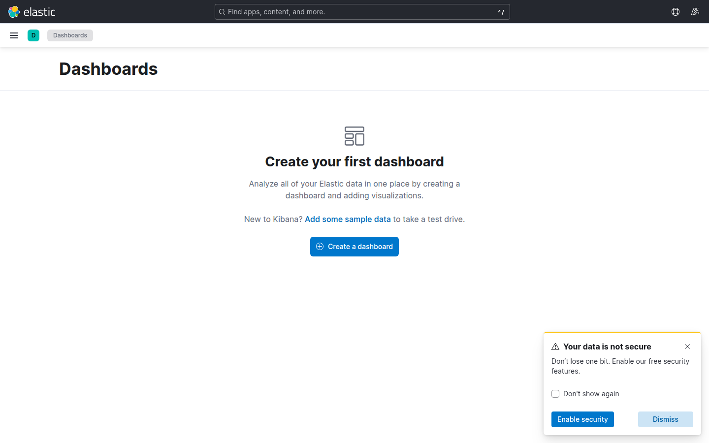

# Laboratorio M05-02 — Dashboard operativo de logs

[▲ Módulo M05](README.md) · [← Anterior](M05-01-lens-primeros-pasos.md) · [Siguiente →](M05-03-dashboard-metricas-host.md)

> ⏱️ ~45 min

**Objetivo:** dashboard con **tasa de ERROR**, **latencia media** y tabla de últimos 500.

---

### Paso 1 — Panel: conteo ERROR

Nueva Lens en `filebeat-*`:

- Filtro KQL: `log_source : "demo-app" and (http.response.status_code >= 500 or message : *status=500*)`
- Métrica: Count · Tipo: **Metric** (número grande).

Guardar como `lab-m05-error-count`.

---

### Paso 2 — Panel: latencia

- Métrica: **Average** de `latency_ms` (o extraer con runtime si falta).
- Filtro: mismos logs `demo-app`.
- Tipo: **Line** vs `@timestamp`.

Guardar como `lab-m05-latency-avg`.

---

### Paso 3 — Panel: últimos eventos

**Logs** panel o tabla Discover embebida:

- Columnas: `@timestamp`, `message`, `url.path`, `http.response.status_code`
- Orden: `@timestamp` desc · Tamaño: 10 filas.

---

### Paso 4 — Crear dashboard

**Dashboards** → **Create dashboard** → añade los tres paneles → **Save** como `lab-m05-ops-logs`.



Anota la URL (incluye el id del objeto).

---

### Paso 5 — Simular incidente

```bash
# Aumentar ERROR temporalmente editando loggen no es trivial; filtra ventana donde ya hay ERROR
```

En Discover confirma picos de `status=500` en la línea temporal del dashboard.

---

## Validación

- [ ] Dashboard `lab-m05-ops-logs` con ≥3 paneles.
- [ ] Métrica ERROR reacciona al time picker.
- [ ] Tabla muestra eventos recientes.

---

## Antes de seguir

Un dashboard operativo responde: **¿cuántos?, ¿qué tan grave?, ¿cuáles son los últimos?**
