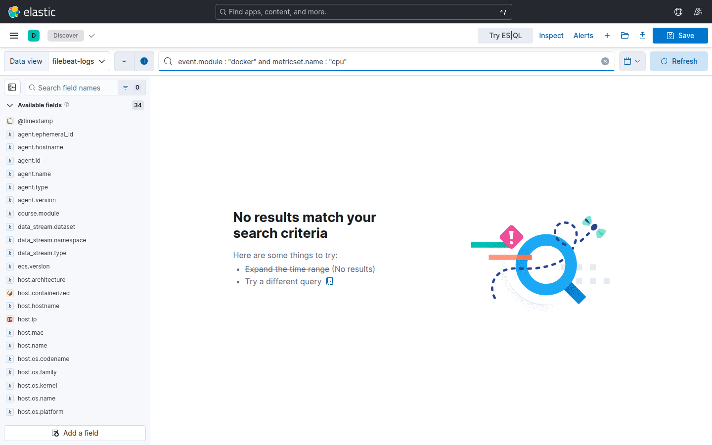
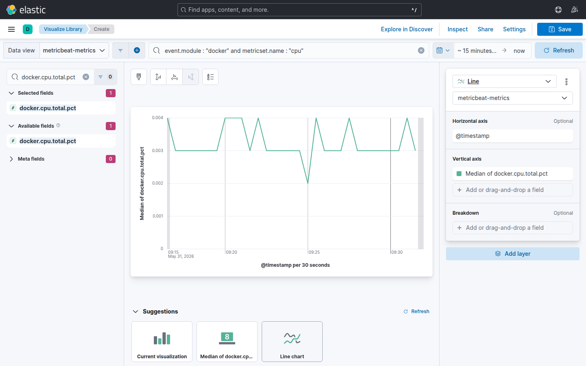
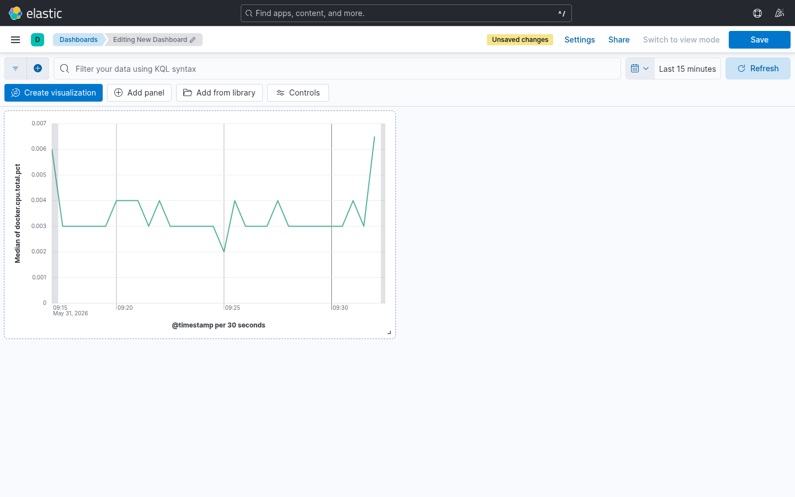

# Laboratorio M05-03 — Dashboard de métricas del host

[▲ Módulo M05](README.md) · [← Anterior](M05-02-dashboard-logs-operacion.md) · [Siguiente →](M05-04-saved-objects-y-alertas-vista.md)

> ⏱️ ~50 min · 🧩 Metricbeat activo

**Objetivo:** panel de **CPU Docker** y enlazarlo temporalmente con errores de app en el mismo `host.name`.

> **Correlación ≠ causalidad:** ver CPU alta y ERROR a la vez sugiere hipótesis («¿el contenedor va justo de recursos?»). Hay que validar con logs, traces o cambios recientes — el lab entrena el **hábito** de mirar ambas señales.

---

### Paso 1 — Data view `metricbeat-*`

Metricbeat publica métricas del host y contenedores Docker en índices distintos a Filebeat — mismo `@timestamp`, distinto `event.module`.

Discover → data view `metricbeat-*` → KQL:

```text
event.module : "docker" and metricset.name : "cpu"
```

Time picker: **Last 30 minutes**.



Anota `host.name` del nodo donde corre el stack. Lo usarás para alinear logs y métricas en el paso 4.

---

### Paso 2 — Lens CPU

**Visualize Library** → **Create visualization**:

| Control | Valor |
|---------|-------|
| Data view | `metricbeat-*` |
| KQL | `event.module : "docker" and metricset.name : "cpu"` |
| Tipo | **Line** |
| Métrica | **Average** de `docker.cpu.total.pct` |
| Breakdown (opcional) | `container.name` |

Guardar como `lab-m05-docker-cpu`.



**Caso de uso:** identificar qué contenedor (`lab-elasticsearch`, `lab-kibana`, etc.) consume CPU cuando el host va al límite.

> El valor puede estar en escala 0–1 o 0–100 según versión; comprueba un documento en Discover antes de fijar el formato del eje.

---

### Paso 3 — Dashboard `lab-m05-host-metrics`

**Dashboards** → **Create dashboard** → añade `lab-m05-docker-cpu` (y, si creaste panel de memoria, `docker.memory.usage.pct`).

**Save** como `lab-m05-host-metrics`.



**Producción:** aquí miras contenedores del lab; en prod agruparías por `kubernetes.pod.name` o `container.name` con labels de equipo/servicio.

---

### Paso 4 — Correlación manual

Abre en otra pestaña el dashboard **M05-02** (`lab-m05-ops-logs`). Iguala time picker (misma ventana de 30 min) y desplázate al mismo tramo temporal.

| Observación | Interpretación posible | Siguiente paso |
|-------------|------------------------|----------------|
| CPU alta + 500 en logs | Presión de recursos | `docker stats`, revisar heap ES |
| CPU baja + 500 | Fallo lógico / dependencia externa | traces, logs de app |
| CPU alta + sin 500 | Trabajo batch, GC, reindex | normal si es transitorio |

KQL cruzado (mismo host):

```text
host.name : "<tu-host>" and event.module : "docker"
```

Documenta en una frase qué viste — aunque sea «no correlacionan en este lab».

---

### Paso 5 — Enlace entre dashboards

En el dashboard de logs, edita un panel → **Panel settings** → descripción o **Markdown** con enlace al dashboard de métricas y el `host.name`.

En operaciones reales los runbooks enlazan dashboards, Grafana y runbooks de escalado — reduce fricción a las 3 AM.

---

## Validación

- [ ] Dashboard métricas guardado (`lab-m05-host-metrics`).
- [ ] Filtro `event.module : "docker"` devuelve datos en Discover.
- [ ] Documentaste un intento de correlación tiempo + host (aunque no haya causalidad).

---

## Antes de seguir

Métricas + logs en dashboards separados enlazados es madurez intermedia. M10 añade **stack monitoring** (salud del propio Elasticsearch) — otra capa cuando el problema no es la app sino la plataforma.
