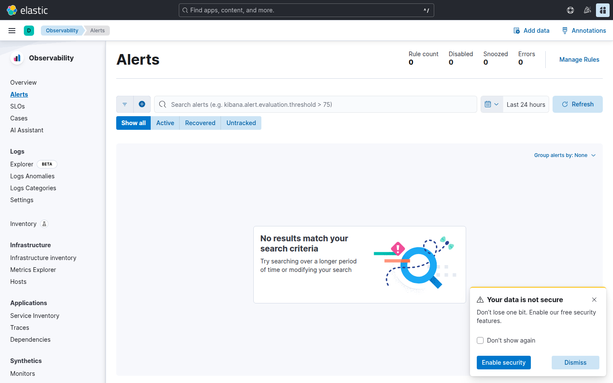

# Laboratorio M05-04 — Saved objects y vista previa de alertas

[▲ Módulo M05](README.md) · [← Anterior](M05-03-dashboard-metricas-host.md) · [Siguiente módulo →](../M06-ilm-snapshots/M06-01-politica-ilm-basica.md)

> ⏱️ ~45 min

**Objetivo:** exportar dashboards a NDJSON y crear una **regla de umbral** simple (preparación para M08).

---

### Paso 1 — Exportar objetos

**Stack Management** → **Saved Objects** → selecciona tus visualizaciones y dashboards `lab-m05-*` → **Export** → descarga `lab-m05-export.ndjson`.


Guárdalo en `labs/M05-dashboards-kibana/` solo si tu formador lo pide (no es obligatorio commitear).

---

### Paso 2 — Regla de umbral (Kibana)

**Observability** → **Alerts** → **Create rule** → **Elasticsearch query**:



- Índice: `filebeat-*`
- Query: `log_source : "demo-app" and http.response.status_code : 500` (o KQL equivalente)
- Condición: **count > 0** en **1 min**
- Acción: **Index threshold** → **Log** (o email de prueba si configurado)

Nombre: `lab-m05-error-spike`.

---

### Paso 3 — Probar la regla

Espera 2–3 ciclos con `loggen` activo. En **Alerts** → **Rule details** revisa **Last response**.

---

### Paso 4 — Import en entorno limpio (simulación)

En otro Codespace (opcional): **Import** el NDJSON y comprueba que los ids no colisionan (Kibana puede regenerar).

---

### Paso 5 — API de reglas (lectura)

```bash
curl -fsS 'http://localhost:5601/api/alerting/rules/_find?per_page=5' 2>/dev/null | head -20 || echo "Requiere auth en M09+"
```

Sin seguridad, la UI es la vía principal.

---

## Validación

- [ ] Export NDJSON generado.
- [ ] Regla `lab-m05-error-spike` en estado activo o disparada al menos una vez.
- [ ] Entiendes diferencia entre dashboard (visual) y alerta (acción).

---

## Antes de seguir

M08 profundiza en Watcher y acciones webhook; M05 deja la base visual.
