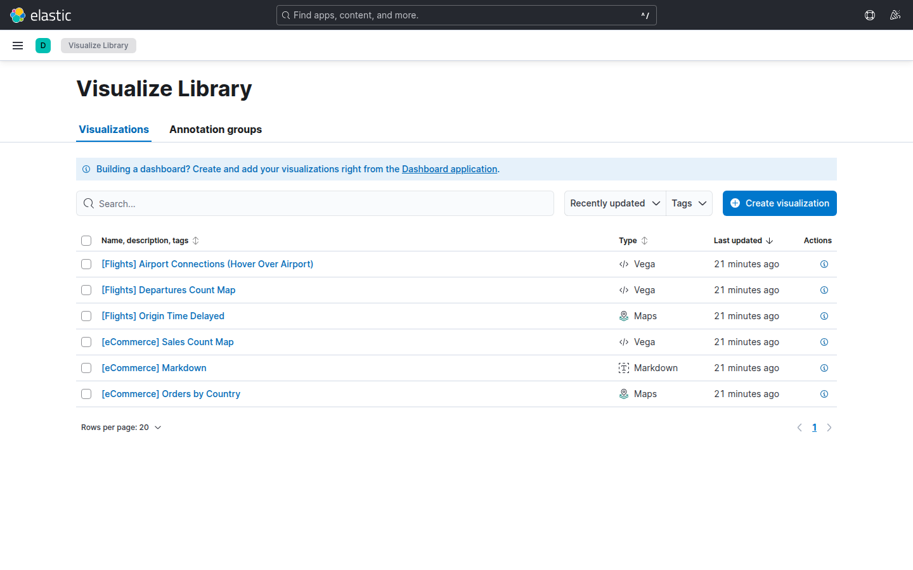
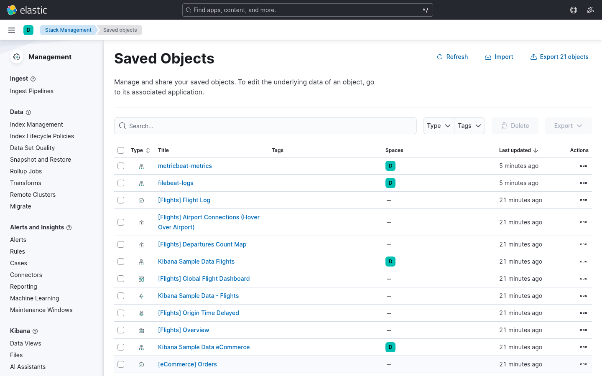
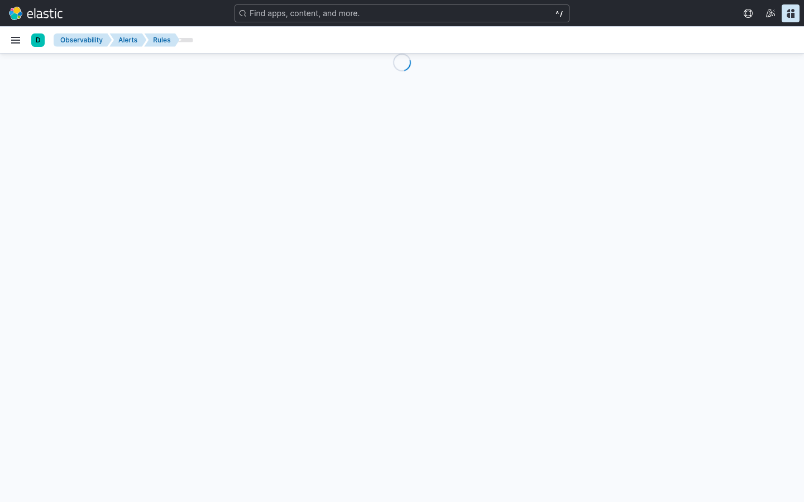
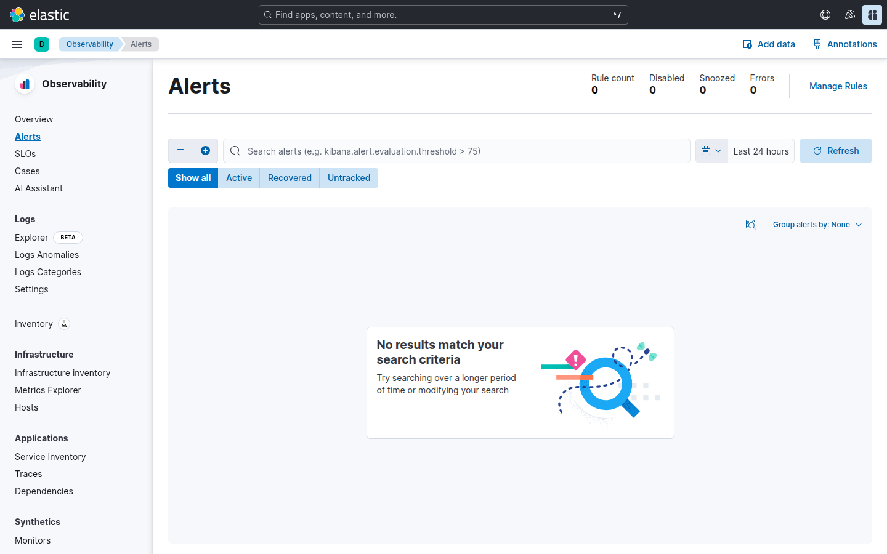
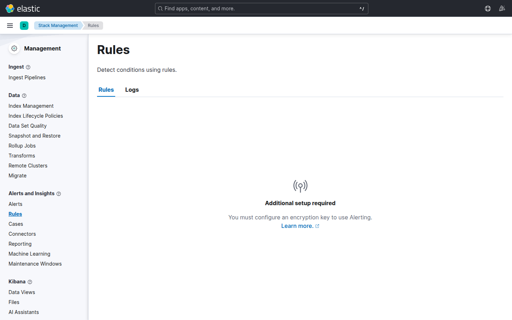

# Laboratorio M05-04 — Saved objects y vista previa de alertas

[▲ Módulo M05](README.md) · [← Anterior](M05-03-dashboard-metricas-host.md) · [Siguiente módulo →](../M06-ilm-snapshots/M06-01-politica-ilm-basica.md)

> ⏱️ ~45 min

**Objetivo:** exportar dashboards a NDJSON y crear una **regla de umbral** simple (preparación para M08).

> **Saved objects** son la «configuración» de Kibana (dashboards, visualizaciones, reglas). Exportar/importar permite promover de lab a staging o compartir con un compañero. Las **alertas** cierran el ciclo: de «veo el pico» a «me avisan».

---

### Paso 1 — Visualize library

**Visualize Library** lista las Lens de M05-01–03 (`lab-m05-*`). Úsala para comprobar nombres antes de exportar.



---

### Paso 2 — Exportar objetos

**Stack Management** → **Saved Objects** → filtra `lab-m05` → selecciona visualizaciones y dashboards → **Export** → descarga `lab-m05-export.ndjson`.



Guárdalo en `labs/M05-dashboards-kibana/` solo si tu formador lo pide (no es obligatorio commitear).

**Qué incluye el NDJSON:** definiciones de Lens, referencias a data views (por id/nombre), time picker por defecto. **No** incluye los datos de Elasticsearch — en el fork destino deben existir los mismos índices o data views.

---

### Paso 3 — Regla de umbral (Kibana)

**Observability** → **Alerts** → **Create rule** → **Elasticsearch query**:



| Campo | Valor lab | Notas |
|-------|-----------|-------|
| Índice / data view | `filebeat-*` | Misma familia que M05-02 |
| Query | `log_source : "demo-app" and (status_code : 500 or message : *status=500*)` | Ajusta si solo tienes status en `message` |
| Condición | count **> 0** en **1 min** | Muy sensible — válido para probar mecanismo |
| Acción | **Log** | Sin SMTP en lab; en prod sería PagerDuty/Slack |

Nombre: `lab-m05-error-spike`.

**Producción:** esta regla sería ruidosa. Usarías ventana más larga, umbral más alto o agrupación por `service.name`. Aquí priorizas ver **un disparo** en tu sesión.

---

### Paso 4 — Gestionar reglas

**Stack Management** → **Rules** (o **Observability** → **Alerts**):





En **Rule details** → **Last response**:

| Estado | Significa |
|--------|-----------|
| `ok` | Condición no cumplida en la última ventana |
| `active` | Condición cumplida, alerta en curso |
| `error` | Query inválida, índice missing, permisos |

Espera 2–3 ciclos con `loggen` activo (~10 % 500). Si no dispara en 10 min, ejecuta el `_count` de M08-02 para confirmar que hay 500 en el índice.

---

### Paso 5 — Import en entorno limpio (simulación)

En otro Codespace (opcional): **Import** el NDJSON.

Kibana puede preguntar por conflictos de id — elige **rename** o **overwrite** según quieras duplicar o sustituir. Tras import, abre el dashboard y comprueba:

- [ ] Data views `filebeat-*` existen o se recrean.
- [ ] Paneles cargan (no «Index pattern missing»).
- [ ] Time picker muestra datos recientes.

Simula el flujo «compañero fork → import → demo en clase».

---

### Paso 6 — API de reglas (lectura)

```bash
curl -fsS 'http://localhost:5601/api/alerting/rules/_find?per_page=5' 2>/dev/null | head -20 || echo "Requiere auth en M09+"
```

Sin seguridad (lab), la UI basta; con RBAC (M09), la API permite GitOps de reglas.

---

## Validación

- [ ] Export NDJSON generado.
- [ ] Regla `lab-m05-error-spike` activa o disparada al menos una vez (o explicas por qué no).
- [ ] Entiendes diferencia dashboard (informar) vs alerta (actuar).

---

## Antes de seguir

M08 profundiza en Watcher, webhooks y reglas sobre métricas. M05 deja el vocabulario: saved object, rule type, action, last response.
