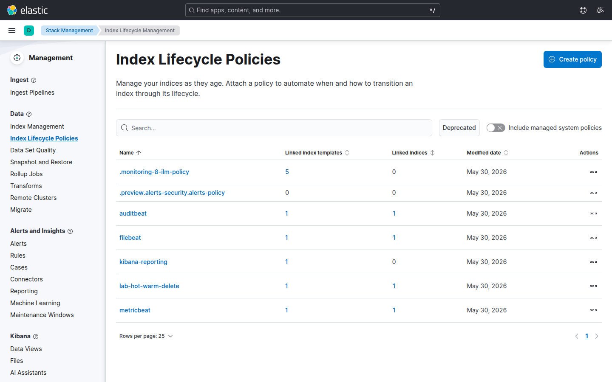

# Laboratorio M06-01 — Política ILM básica

[▲ Módulo M06](README.md) · [Siguiente →](M06-02-rollover-alias.md)

> ⏱️ ~35 min

**Objetivo:** crear y revisar la política `lab-hot-warm-delete` con fases aceleradas para laboratorio.

> **Por qué ILM:** sin política, los índices crecen hasta llenar disco o obligarte a borrar a mano. ILM convierte una decisión de negocio («guardamos logs 90 días») en acciones automáticas sobre Elasticsearch.

---

### Paso 1 — Aplicar script del repo

El script `setup-ilm-lab.sh` hace dos cosas: define la política ILM y la plantilla de índice que la asocia a `lab-ilm-demo-*`. En producción harías lo mismo vía Terraform, API o UI — aquí lo automatizamos para no perder tiempo en YAML repetitivo.

```bash
./scripts/setup-ilm-lab.sh
curl -fsS 'http://localhost:9200/_ilm/policy/lab-hot-warm-delete?pretty'
```

**Qué buscar en la respuesta JSON**

| Bloque | Campo clave | Valor en lab |
|--------|-------------|--------------|
| `phases.hot` | `rollover.max_primary_shard_size` | `1gb` |
| `phases.hot` | `rollover.max_age` | `7d` |
| `phases.warm` | `min_age` | `1m` |
| `phases.delete` | `min_age` | `5m` |

Si el `curl` devuelve la política pero no ves plantilla, ejecuta de nuevo el script; sin plantilla los índices nuevos no heredarán ILM.

---

### Paso 2 — UI de ILM

Kibana → **Stack Management** → **Index Lifecycle Policies** → abre `lab-hot-warm-delete`.




**Qué significa cada fase**

| Fase | Config en lab | Caso de uso en producción | Qué hace Elasticsearch |
|------|---------------|---------------------------|------------------------|
| **Hot** | Rollover 1 GB o 7 d | Logs recientes, alta escritura y búsquedas frecuentes (checkout, API gateway) | Índice activo; cuando crece demasiado, **rollover** crea uno nuevo |
| **Warm** | Tras **1 min** | Datos que aún consultas pero casi no indexas (informes mensuales, auditoría) | Baja prioridad de recuperación; en lab también **shrink** a 1 shard |
| **Delete** | Tras **5 min** | Cumplir retención legal o de coste (GDPR, política interna) | Borra el índice — **irreversible** sin snapshot previo |

**Compara lab vs producción:** los tiempos del lab (minutos) existen solo para que veas el ciclo en una sesión. En un clúster real, warm suele medirse en **semanas** y delete en **meses**. La lógica es la misma; cambia la escala temporal.

**Pregunta para reflexionar:** si tu checkout genera 200 GB/día, ¿pondrías el rollover en hot por tamaño (GB) o por edad (días)? ¿Qué pasa si el índice nunca llega a 1 GB pero acumulas 30 días de datos?

---

### Paso 3 — Explicación operativa

Completa en tus notas una tabla como esta (valores orientativos):

| Escenario | Hot (rollover) | Warm | Delete total |
|-----------|----------------|------|--------------|
| Logs app crítica (prod) | 50 GB o 1 d | 30 d | 90 d |
| Métricas infra (prod) | 7 d | 60 d | 400 d |
| **Este lab** | 1 GB o 7 d | 1 min | 5 min |

Anota también **qué equipo decide** cada número: SRE (disco), legal (retención), negocio (historial de pedidos). ILM no elige solo — implementa una política acordada.

---

## Validación

- [ ] Política visible en API y UI.
- [ ] Puedes explicar hot/warm/delete con un ejemplo de tu entorno (real o imaginado).
- [ ] Sabes por qué los tiempos del lab no son válidos en producción.

---

## Antes de seguir

En data streams de Filebeat/Metricbeat la política ILM suele venir empaquetada con la integración. Aquí usamos un **índice clásico con alias** para ver el mecanismo sin capas extra — en M06-02 harás rollover sobre ese patrón.
