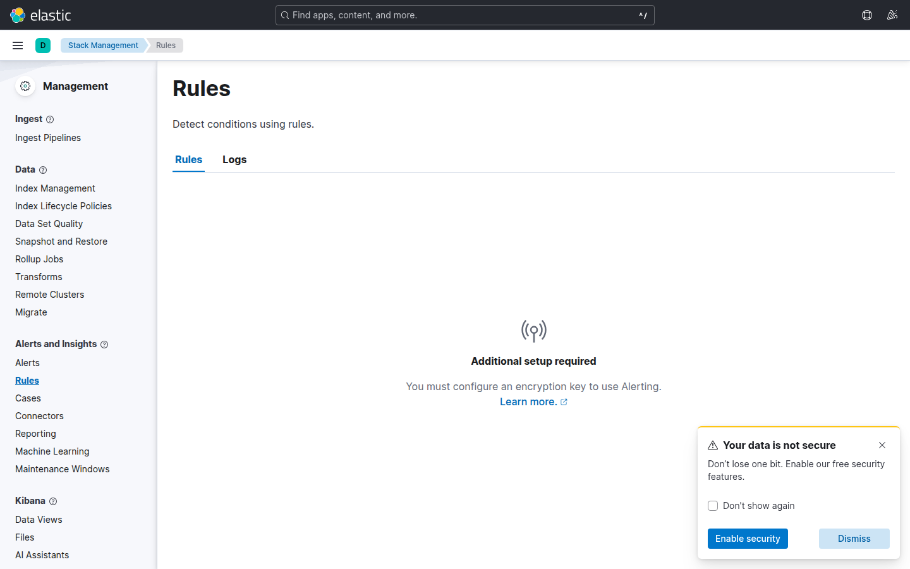

# Laboratorio M08-01 — Regla de umbral en métricas

[▲ Módulo M08](README.md) · [Siguiente →](M08-02-regla-errores-logs.md)

> ⏱️ ~40 min · 🧩 Metricbeat activo

**Objetivo:** alerta cuando **CPU Docker** supere umbral (ajusta al percentil real de tu entorno).

> **Tipo de alerta:** *Metric threshold* vigila series temporales agregadas (CPU, memoria, lag de cola). Es la herramienta para SRE de infraestructura. M08-02 usará *Elasticsearch query* sobre logs — complementario, no sustituto.

---

### Paso 1 — Baseline en Discover

Antes de alertar necesitas saber qué es «normal» en tu lab. Un umbral copiado de documentación sin baseline genera falsos positivos o alertas muertas.

Discover → data view `metricbeat-*`:

```text
event.module : "docker" and metricset.name : "cpu"
```

Anota durante 2–3 min:

| Campo | Tu valor aprox. |
|-------|-----------------|
| `docker.cpu.total.pct` (media visual) | |
| `container.name` con más CPU | |
| Rango típico (mín–máx) | |

**Caso de uso:** en producción basarías el umbral en percentil 95 histórico + margen, no en «0.5 porque sí».

---

### Paso 2 — Crear regla

**Observability** → **Alerts** → **Create rule** → **Metric threshold**:



| Parámetro | Valor inicial | Ajuste |
|-----------|---------------|--------|
| Metric | average `docker.cpu.total.pct` | Comprueba escala 0–1 vs 0–100 en Discover |
| Group by | `container.name` | Alerta por contenedor, no global difusa |
| Threshold | above **0.5** | Baja a tu P95 si no dispara nunca |
| Ventana | 5 min | Evita un pico de 10 s |

Nombre: `lab-m08-cpu-high`.

**Acción mínima:** añade **Log action** o **Index** (según UI) para ver el disparo en historial — sin acción, la regla cambia estado pero nadie se entera.

---

### Paso 3 — Observar disparos

Con carga normal del lab es posible que **no** dispare — Elasticsearch en idle puede estar muy por debajo de 0.5.

**Estrategia de validación (solo lab):**

1. Baja umbral temporalmente a **0.01** (1 %).
2. Espera 1–2 ciclos de evaluación.
3. Confirma estado `active` o entrada en historial.
4. **Vuelve a subir** el umbral a un valor sensato antes de cerrar el ejercicio.

Documenta: «disparó con umbral 0.01; en prod usaría X según baseline del paso 1».

---

## Validación

- [ ] Regla guardada y **Enabled**.
- [ ] Al menos un evento en historial (aunque sea con umbral bajo de prueba).
- [ ] Anotaste baseline CPU y por qué elegiste el umbral final.

---

## Antes de seguir

Kibana 8 unifica alerting (metric, log threshold, ES query). **Watcher** (M08-03) sigue para lógica compleja por API. Elige metric rules para lo simple; Watcher cuando necesites pipelines condicionales pesados.
