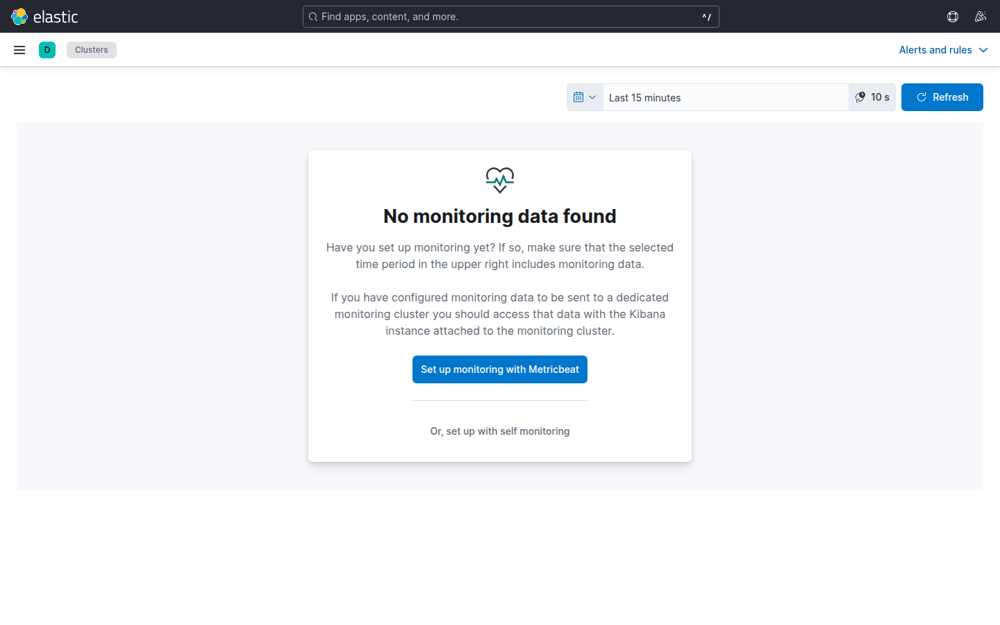

# Laboratorio M10-01 — Stack monitoring en Kibana

[▲ Módulo M10](README.md) · [Siguiente →](M10-02-logs-cluster-es.md)

> ⏱️ ~30 min

**Objetivo:** localizar vistas de **Stack Monitoring** (o equivalente en 8.17) y leer salud de Elasticsearch.

> **Self-observability:** cuando Discover «no muestra logs nuevos», el fallo puede ser Filebeat **o** Elasticsearch saturado. Stack monitoring (o métricas JVM por API) responde: «¿el clúster aguanta?».

---

### Paso 1 — Stack Monitoring en Kibana

Kibana → **Stack Management** → **Stack Monitoring** (o **Monitoring** en el menú lateral / ☰ → Observability).



**Si ves «No monitoring data found»** (habitual en lab sin configurar collection):

| Opción | Qué implica |
|--------|-------------|
| *Set up with Metricbeat* | Métricas dedicadas a `.monitoring-*` (recomendado en prod) |
| *Self monitoring* | ES/Kibana se monitorizan a sí mismos (más simple, más carga en el nodo) |
| **API directa (este lab)** | Paso 2 — no dependes de la UI llena |

La captura vacía es **esperada** hasta que habilites collection; no significa que ES esté caído.

---

### Paso 2 — Métricas de nodo por API

Cuando la UI no tiene histórico, el operador consulta la API — mismo criterio que en runbooks automatizados.

```bash
curl -fsS 'http://localhost:9200/_nodes/stats/jvm,os,fs?pretty' | head -50
```

Anota para tu nodo único:

| Métrica | Valor | Umbral orientativo (lab) |
|---------|-------|---------------------------|
| Heap usado % | | > 85 % sostenido → riesgo |
| CPU load | | contexto dependiente |
| Disco libre `fs` | | ILM/snapshots consumen aquí |

**Caso de uso:** antes de un reindex masivo compruebas heap y disco — evitas cluster red en producción.

---

### Paso 3 — Comparar con health-check

```bash
./scripts/health-check.sh
```

¿Coinciden heap % y estado `yellow`/`green` entre script y API?

| Señal | Nodo único lab |
|-------|----------------|
| `yellow` | Normal con 1 nodo y réplicas > 0 |
| `green` + heap alto | Posible GC pressure — mira logs ES (M10-02) |
| health-check OK + UI vacía | Falta collection, no falta clúster |

---

## Validación

- [ ] Consultaste métricas JVM del nodo (UI o API).
- [ ] Relacionaste `yellow` con nodo único sin réplica.
- [ ] Sabes qué hacer si Stack Monitoring está vacío (paso 2, no pánico).

---

## Antes de seguir

Observar el stack evita volar a ciegas cuando fallan logs de negocio. M10-04 montará un dashboard que junta salud de clúster y conteo de Beats.
