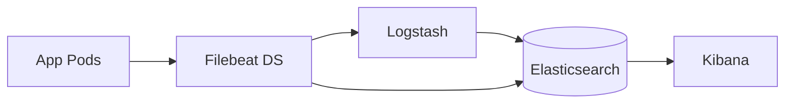

# Laboratorio M11-04 — Patrón Kubernetes (sin kind obligatorio)

[▲ Módulo M11](README.md) · [← Anterior](M11-03-prometheus-metricas.md) · [Siguiente módulo →](../M12-rendimiento-escalabilidad/M12-01-latencia-busqueda.md)

> ⏱️ ~40 min · 🧩 Diseño arquitectónico

**Objetivo:** mapear este repo Docker a un despliegue **ECK / Helm** en Kubernetes.

---

### Paso 1 — Tabla de equivalencias

| Docker lab | Kubernetes típico |
|------------|-------------------|
| `lab-elasticsearch` | StatefulSet + PVC |
| `lab-kibana` | Deployment + Service |
| `lab-filebeat` | DaemonSet |
| `lab-logstash` | Deployment HPA |
| Redpanda | Strimzi / Redpanda Operator |

---

### Paso 2 — Diagrama mermaid

---

### Paso 3 — kind opcional

Si tienes recursos (>16 GB), el formador puede proporcionar manifest ECK mínimo. En Codespaces 8 GB, **quédate en el diagrama** y lista requisitos:

- `vm.max_map_count`
- StorageClass para PVC
- Requests/limits JVM

---

### Paso 4 — Elastic Agent en K8s (una frase)

Elastic Agent como **DaemonSet** sustituye Filebeat+Metricbeat en nodos — integración con autodiscover de pods.

---

## Validación

- [ ] Tabla y diagrama completados.
- [ ] Tres riesgos K8s anotados (disco, memory, shard allocation).

---

## Antes de seguir

M12 trata rendimiento cuando el cluster crece más allá de un nodo lab.
