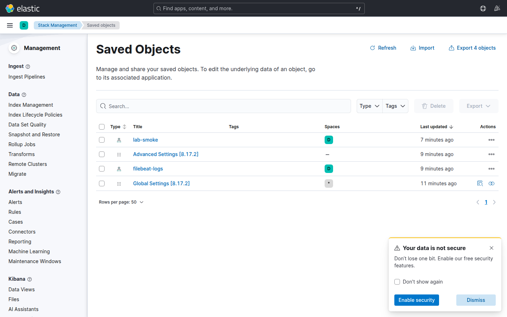

# Laboratorio M12-04 — Checklist de sizing y cierre del curso

[▲ Módulo M12](README.md) · [← Anterior](M12-03-heap-recursos-jvm.md) · [Fin del curso →](../../README.md)

> ⏱️ ~40 min

**Objetivo:** completar checklist de sizing y repasar el pipeline completo M01–M12.

---

### Paso 1 — Checklist sizing (rellena)

| Pregunta | Tu respuesta lab |
|----------|------------------|
| GB RAM Codespace | |
| `ES_JAVA_OPTS` | |
| Retención logs (ILM lab) | minutos |
| Nº shards en `filebeat-*` | |
| ¿Necesitas Kafka? | sí/no + por qué |

---

### Paso 2 — Health check final

```bash
docker compose -f infra/docker-compose.yml --profile beats up -d
./scripts/health-check.sh
```

---

### Paso 3 — Recorrido oral (5 min)

Explica en voz alta:

1. Ingesta (Beats / Fluent Bit / bulk)
2. Procesamiento (Logstash / ingest)
3. Almacenamiento (ILM / snapshots)
4. Visualización y alertas
5. Seguridad y self-monitoring

---

### Paso 4 — Runbook personal

Copia plantilla en tus notas:

```markdown
## Incidente: no hay logs nuevos
1. docker ps | grep filebeat
2. docker logs lab-filebeat --tail 30
3. curl _cluster/health
4. Discover time picker
5. TROUBLESHOOTING.md
```

---

## Validación

- [ ] Checklist sizing completo.
- [ ] Health check OK.
- [ ] Runbook de 5 pasos escrito.

---

## Cierre del curso

Has recorrido **64 h orientativas** de temario en formato lab-first. Siguiente paso profesional: proyecto real con SLAs, seguridad desde día 1 y sizing basado en métricas de producción.

### Reto final

Exporta un dashboard NDJSON de M05 o M10 y compártelo con un compañero importándolo en otro fork.

<details>
<summary>Ver respuestas</summary>

**Exportar**

1. Kibana → ☰ → **Management** → **Stack Management** → **Saved Objects**.

   

2. Marca el dashboard (y dependencias si Kibana lo ofrece).
3. **Export** → descarga `.ndjson`.

**Importar en otro fork**

1. Mismo menú → **Import**.
2. Sube el NDJSON; resuelve conflictos (overwrite/rename).
3. Abre el dashboard y comprueba data views e índices existen en el fork destino.

Los saved objects viven en ES; el NDJSON es el “paquete” portable entre entornos de lab.

</details>
